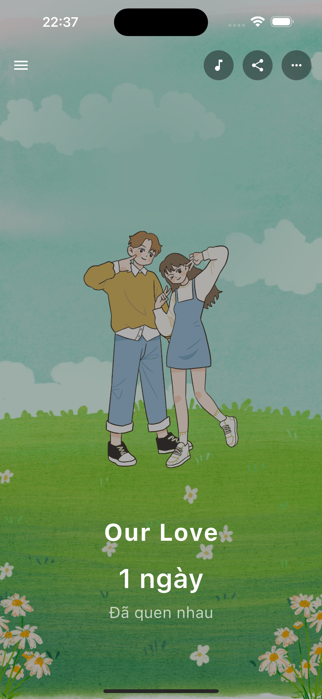
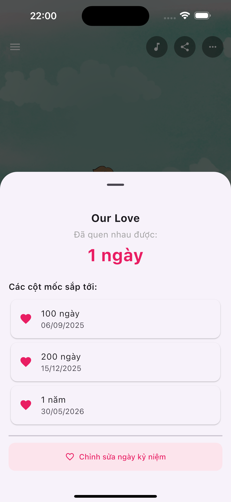
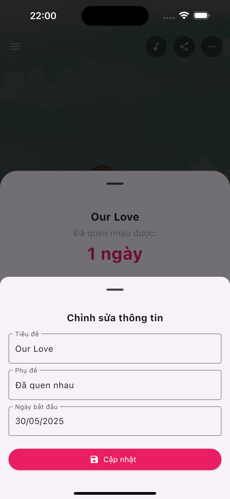
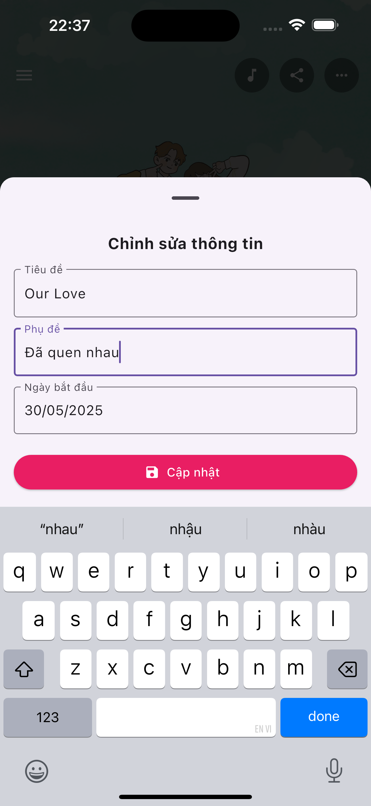
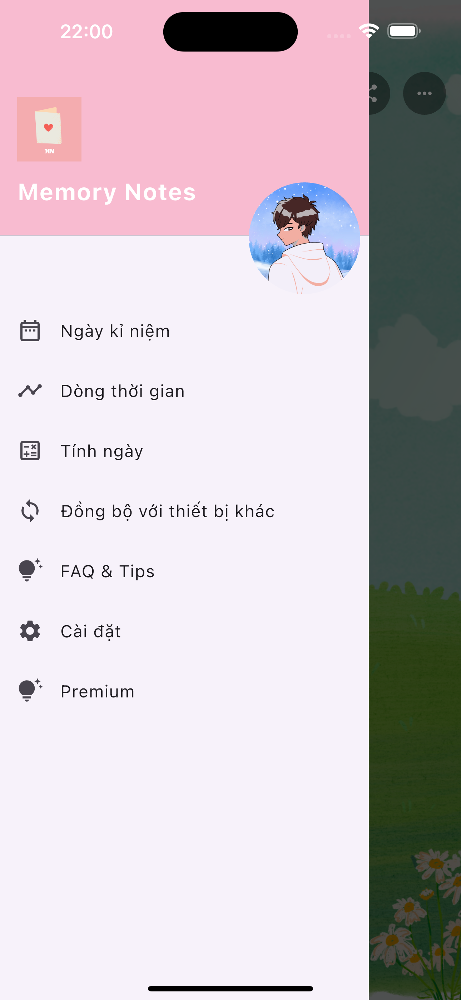
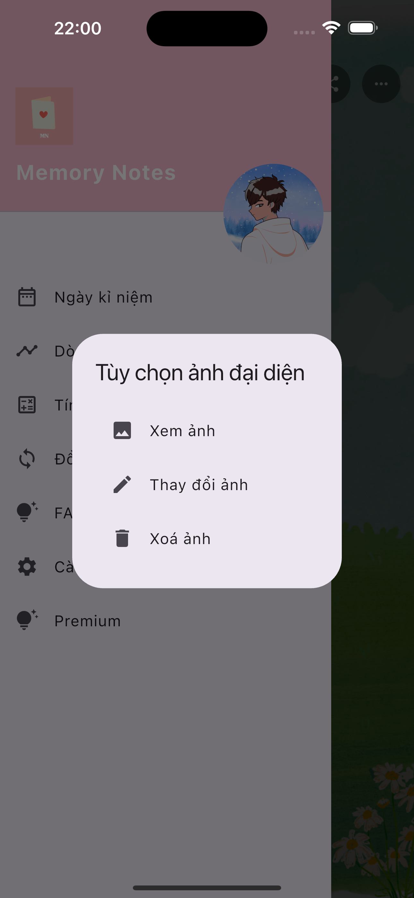
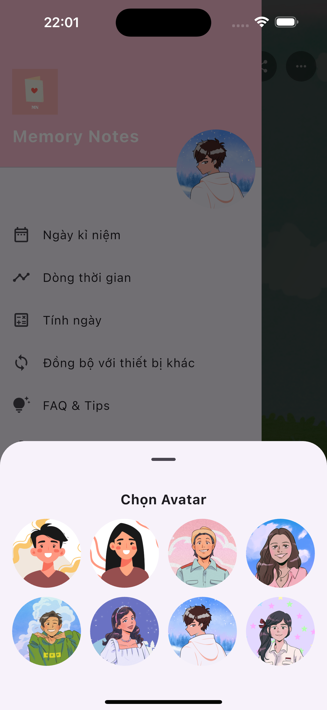
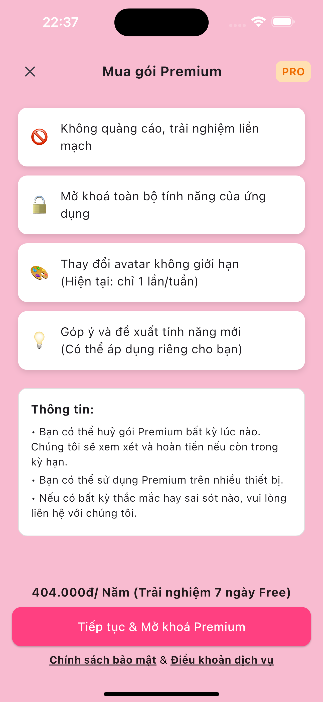

# 📓 Memory Notes

> **Memory Notes** — a place where love is gently archived and memories are never lost.

---

## ✨ Features

- 📅 “Been Together” day counter
- 🎵 Background music support
- ❓ Tips & FAQs section
- 📦 Offline support using Hive
- 💎 Premium features with upgrade option
- 📝 Create and organize meaningful memory notes
- 🔐 PIN code & biometric lock for privacy
- 🚀 And more coming soon...

---

## 🖼️ Screenshots

Here are some screenshots of **Memory Notes** — more features will be implemented and updated soon:

|  |  |  |  |
|:----------------------------------------:|:----------------------------------------:|:----------------------------------------:|:----------------------------------------:|
|  |  |  |  |
|:----------------------------------------:|:----------------------------------------:|:----------------------------------------:|:----------------------------------------:|
|  |  |  |  |
|:----------------------------------------:|:----------------------------------------:|:----------------------------------------:|:----------------------------------------:|


---

## 🧱 Tech Stack

* 💙 **Flutter** – Cross-platform mobile app framework
* 🐝 **Hive** – Lightweight key-value database for offline storage
* 🌿 **Riverpod** – Modern state management with MVVM architecture
* 🎨 **Custom UI** – Designed with a vintage, handwritten journal aesthetic

---

## 🗂️ Project Structure (MVVM + Riverpod)

This project follows a **feature-first** architecture with **MVVM pattern** and **Riverpod** for state management.

```
lib/
├── app/                     # App-level configuration
│   ├── app.dart             # Root widget with MaterialApp
│   └── routes.dart          # Route definitions
│
├── core/                    # Core utilities and shared resources
│   ├── constants/           # App-wide constants and enums
│   ├── extensions/          # Dart extensions
│   ├── providers/           # Global providers
│   ├── services/            # Shared services (e.g., theme, music)
│   ├── theme/               # Light/Dark theme data
│   ├── ui/                  # Custom drawing, animations, etc.
│   ├── widgets/             # Common reusable widgets
│   └── utils/               # Helpers (date formatters, validators, etc.)
│
├── data/                    # Data layer
│   ├── models/              # Data models (Memory, User, etc.)
│   ├── services/            # Local DB, Firebase, APIs
│   └── repositories/        # Data abstraction layer
│
├── domain/                  # Business logic (optional use cases)
│   └── use_cases/           # Memory creation, syncing, etc.
│
├── features/                # Feature-based modules
│   ├── auth/                # Login, registration, user profile
│   ├── background_music/    # Background music control
│   ├── been_together/       # Day counter since a special date
│   ├── faq_tips/            # FAQs and helpful tips
│   ├── lock/                # PIN & biometric authentication
│   ├── memory/              # Create, view, edit memories
│   ├── premium/             # Premium upgrade logic and UI
│   ├── settings/            # App settings (theme, language, backup)
│   └── splash/              # Splash screen & onboarding
│
└── main.dart                # Entry point of the app
```

---

## 🚀 Getting Started

```bash
# 1. Clone the repository
git clone https://github.com/manh-nguyen-dev/memory-notes.git
cd memory-notes

# 2. Install dependencies
fvm flutter pub get

# 3. Generate code (Hive, Riverpod, etc.)
fvm flutter pub run build_runner build --delete-conflicting-outputs

# 4. Run the app
fvm flutter run

```

> 💡 Tip: Use `watch` mode if you frequently modify models or providers:
>
> ```bash
> fvm flutter pub run build_runner watch --delete-conflicting-outputs
> ```

---

## 🤍 License

This project is licensed under the **MIT License**.
Feel free to use, modify, and contribute.

---